# Lab 1 - Run Miyagi App Locally

### Estimated Duration: 60 minutes

## Scenario

You are a developer on the Contoso team responsible for the Miyagi application. The Recommendation service is not yet configured for local development, preventing the team from testing personalized recommendations. Your task is to configure the application, run the services locally, integrate Azure AI Search, and verify that the recommendation service works successfully.

## Overview

In this lab, the focus is on configuring the Miyagi App for operational readiness. Subsequently, attention shifts to understanding the nuanced implementation of the Recommendation service. The practical phase involves executing the Recommendation service and deploying the Miyagi frontend locally for testing and development. A crucial step is optimizing data retrieval efficiency by persisting embeddings in Azure AI Search. The project culminates with a broader exploration of the Miyagi App and Recommendation service, emphasizing a personalized user experience. This task-based approach ensures a systematic progression through the project intricacies, facilitating a comprehensive understanding and effective implementation.

## Lab objectives
In this lab, you will complete the following tasks:

- Task 1: Set up configuration for Miyagi app
- Task 2: Understanding the implementation of the Recommendation service
- Task 3: Run the recommendation service locally
- Task 4: Run the Miyagi frontend locally
- Task 5: Persist embeddings in Azure AI Search
- Task 6: Explore the Miyagi App and Recommendation service  by Personalizing

## Task 1: Set up configuration for the Miyagi app

In this lab, you will configure the Miyagi app by setting up the environment, installing dependencies, and preparing the database for a seamless development experience.

1. Open **Visual Studio Code** from the Lab VM desktop by double-clicking on it.

   

   >**Note** If the **Join us in making prompt-flow extension better!** window is prompted, click on **No, thanks**.

   
   
1. In **Visual Studio Code**, from the menu bar select **File (1)** > **Open folder (2)**.

   

1. Within **File Explorer**, navigate to **C:\LabFiles\miyagi** select **miyagi** (1) and click **Select folder (2)**

   .png)

1. In **Visual Studio Code**, click on **Yes, I trust the authors** when the **Do you trust the authors of the files in this folder?** window is prompted.

    
   
1. Expand **miyagi > ui** directory and verify that **.env** file is present. 

1. Expand **miyagi/services/recommendation-service/dotnet** directory and verify that **appsettings.json** file is present.

   
  
1. In the **appsettings.json** file, replace the following values for the variables below.

   | **Variables**                | **Values**                                                    |
   | ---------------------------- |---------------------------------------------------------------|
   | deploymentOrModelId          | **<inject key="CompletionModel" enableCopy="true"/>**         |
   | embeddingDeploymentOrModelId | **<inject key="EmbeddingModel" enableCopy="true"/>**          |
   | endpoint                     | **<inject key="OpenAIEndpoint" enableCopy="true"/>**          |
   | apiKey                       | **<inject key="OpenAIKey" enableCopy="true"/>**               |
   | azureCognitiveSearchEndpoint | **<inject key="SearchServiceuri" enableCopy="true"/>**        |
   | azureCognitiveSearchApiKey   | **<inject key="SearchAPIkey" enableCopy="true"/>**            |
   | cosmosDbUri                  | **<inject key="CosmosDBuri" enableCopy="true"/>**             |
   | blobServiceUri               | **<inject key="StorageAccounturi" enableCopy="true"/>**       |
   | bingApiKey                   | **<inject key="Bing_API_KEY" enableCopy="true"/>**           |
   | cosmosDbConnectionString     | **<inject key="CosmosDBconnectinString" enableCopy="true"/>** |
   
   > **Note**: FYI, the above values/Keys/Endpoints/ConnectionString of Azure Resources are directly injected into labguide. Leave default settings for "cosmosDbContainerName": "recommendations" and "logLevel": "Trace".

      
   
1. Once the values are updated, save the file by pressing **CTRL + S**.

1. Navigate to **miyagi/sandbox/usecases/rag/dotnet** and verify the **.env** file is present.

   
  
1. In the **.env** file, replace the following values for the variables below.

   | **Variables**                          | **Values**                                            |
   | ---------------------------------------| ------------------------------------------------------|
   | AZURE_OPENAI_ENDPOINT                  | **<inject key="OpenAIEndpoint" enableCopy="true"/>**  |
   | AZURE_OPENAI_CHAT_MODEL                | **<inject key="CompletionModel" enableCopy="true"/>** |
   | AZURE_OPENAI_EMBEDDING_MODEL           | **<inject key="EmbeddingModel" enableCopy="true"/>**  |
   | AZURE_OPENAI_API_KEY                   | **<inject key="OpenAIKey" enableCopy="true"/>**       |
   | AZURE_COGNITIVE_SEARCH_ENDPOINT        | **<inject key="SearchServiceuri" enableCopy="true"/>**|
   |AZURE_COGNITIVE_SEARCH_API_KEY          | **<inject key="SearchAPIkey" enableCopy="true"/>**    |
   
   

1. After updating the values, save the file by pressing **CTRL + S**.

## Task 2: Understanding the implementation of the Recommendation service

In this lab, you will explore the implementation of the Recommendation service, focusing on its algorithms and data processing methods to deliver personalized suggestions.

The Recommendation service implements the RAG pattern using the Semantic Kernel SDK. The details of the implementation are captured in the Jupyter notebook in the folder miyagi/sandbox/usecases/rag/dotnet. You can open the notebook in VSCode and run the cells to understand step-by-step details of how the Recommendation Service is implemented. Pay special attention to how the RAG pattern is implemented using Semantic Kernel. Select the kernel as **.NET Interactive** in the top right corner of the notebook.

1. In the Visual Studio Code, navigate to **miyagi/sandbox/usecases/rag/dotnet** folder and select **rag-workflow.ipynb**.

   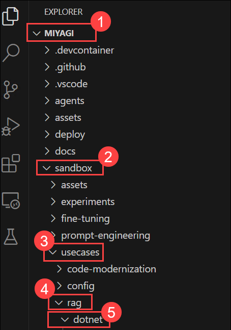

1. In **Visual Studio Code**, open the terminal by pressing **CTRL+J**, and run the following command to verify the installation of **.NET version 10.x.x**.

   ```
   dotnet --version
   ```

1. Open the Extensions panel using **Ctrl+Shift+X (1)**, search under the **recommended section (2)** and manually install the following two extensions:
 
   - **Python (3)** (by Microsoft)
   - **Jupyter (4)** (by Microsoft)

      

1. Once installed, run the following commands in the terminal to set up the .NET Interactive kernel for Jupyter.
 
   Install **.NET Interactive globally**:
 
   ```powershell
   dotnet tool install --global Microsoft.dotnet-interactive
   ```
   
   **Refresh the PATH** to make the tool available in the current terminal session:
   
   ```powershell
   $env:PATH += ";$env:USERPROFILE\.dotnet\tools"
   ```
   
   **Install Jupyter** if it is not already present in the environment:
   
   ```powershell
   python -m pip install jupyter
   ```
   
   Register the .NET Interactive kernels with Jupyter:
   
   ```powershell
   dotnet-interactive jupyter install
   ```
   
   **Verify the kernels** were registered successfully:
   
   ```powershell
   jupyter kernelspec list
   ```
 
   You should see `.net-csharp`, `.net-fsharp`, and `.net-powershell` listed in the output.
 
   > **Close and reopen** Visual Studio Code to see the reflected changes.
 
1. Authenticate with your Azure account by running the following command in the terminal:
 
   ```powershell
   az login
   ```
 
   - A browser window will open prompting you to sign in. Select **Work or School Account** and provide your lab credentials.
 
      

      

      

      

   Once signed in, verify the login was successful by running:
   
   ```none
   az account show
   ```
   
   You should see your subscription details printed in the terminal.
 
1. Open the notebook file and select the appropriate kernel by clicking the **kernel selector** in the top-right corner of the notebook. Choose **Existing Jupyter Kernels -> .NET (C#)** for the notebook's language.

   

   
 
   > **Note:** If the newly installed kernels do not appear in the kernel selector immediately, wait 15–20 seconds and try again.
 
1. **Execute the notebook cell by cell** (using either Ctrl + Enter to stay on the same cell or Shift + Enter to advance to the next cell) and observe the results of each cell execution.
  
   > **Note**: Please do not click on the **Run All** option to execute all the cells at a time; this may lead to exceeding the token limit, resulting in the error: 503 Service unreachable.

   > **Note**: Ensure that the **Python extension** is installed before running the cells.

   > **Note**: In case any issues or errors occur related to the exceeded call rate limit of your current OpenAI S0 pricing tier. Please wait for 15 to 20 seconds and re-run the cell

1. In the **Load settings from .env file** code cell, click the **Run (▶)** button to execute the cell. Wait for the cell to complete successfully before proceeding to the next step.

   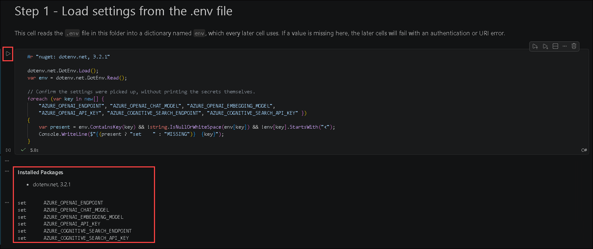

1. In the **Install the Semantic Kernel packages** code cell, click the **Run (▶)** button to execute the cell. Wait for the cell to complete successfully before proceeding to the next step.

   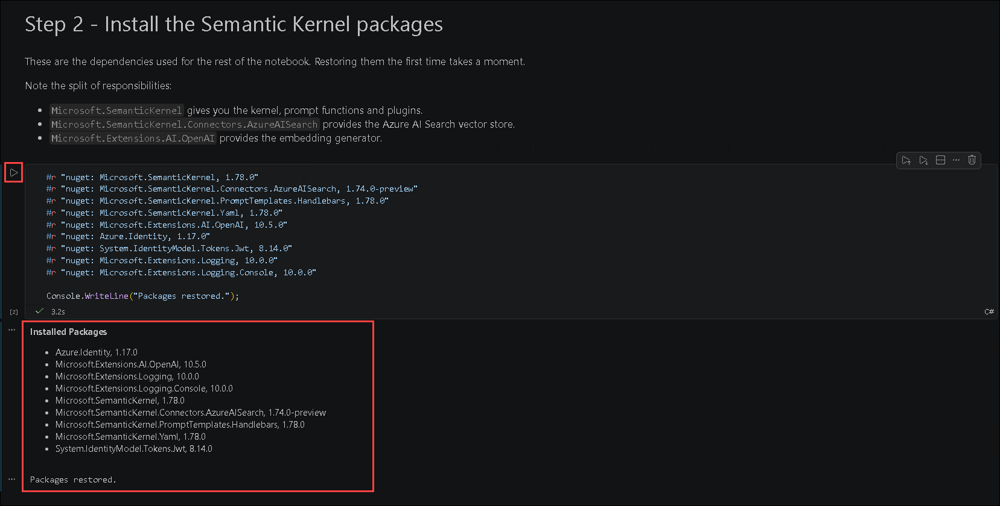

1. In the **Check your Azure sign-in** code cell, click the **Run (▶)** button to execute the cell.

   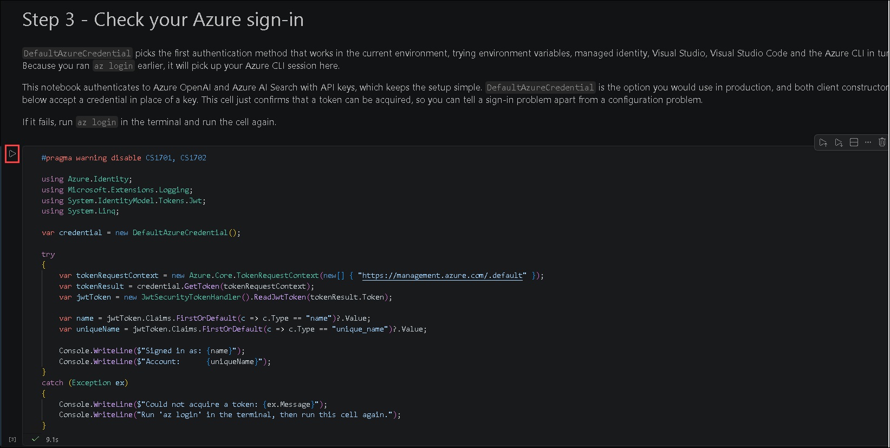

   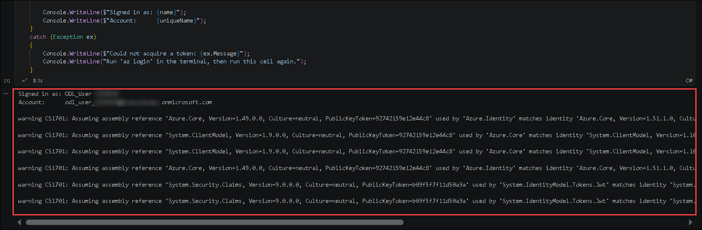

1. In the **Build the kernel** code cell, click the **Run (▶)** button to execute the cell. Wait for the cell to complete successfully before proceeding to the next step.

   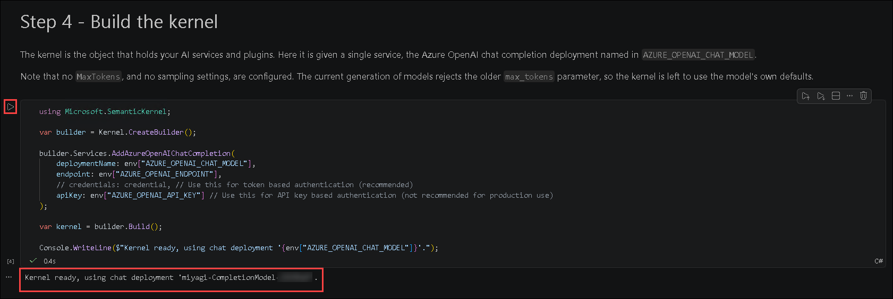

1. In the **Connect Azure AI Search as a vector store** code cell, click the **Run (▶)** button to execute the cell.

   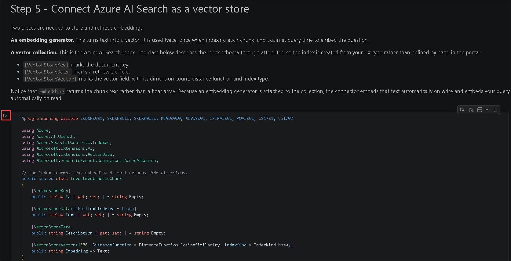

   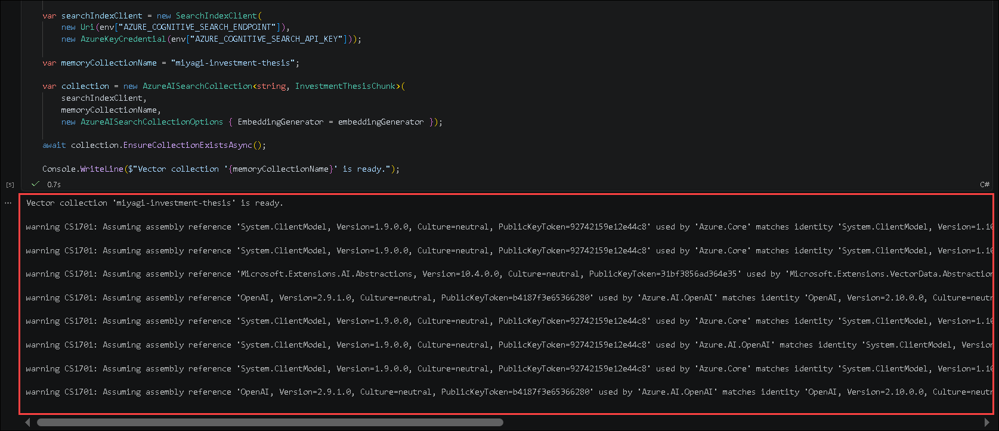

1. In the **Chunk the dataset and persist the embeddings** code cell, click the **Run (▶)** button to execute the cell.

   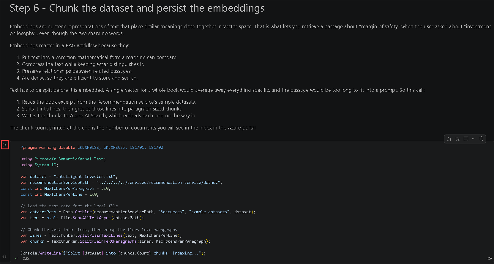

   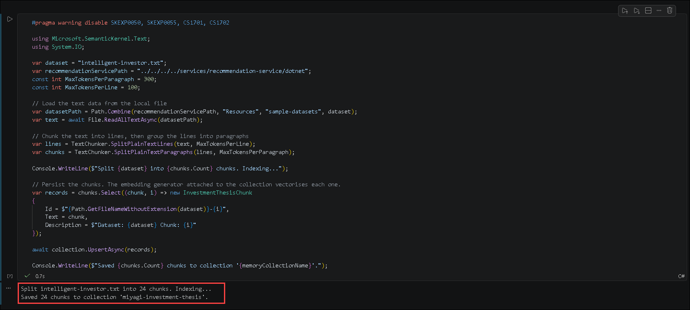

1. In the **Search and retrieve documents** code cell, click the **Run (▶)** button to execute the cell.

   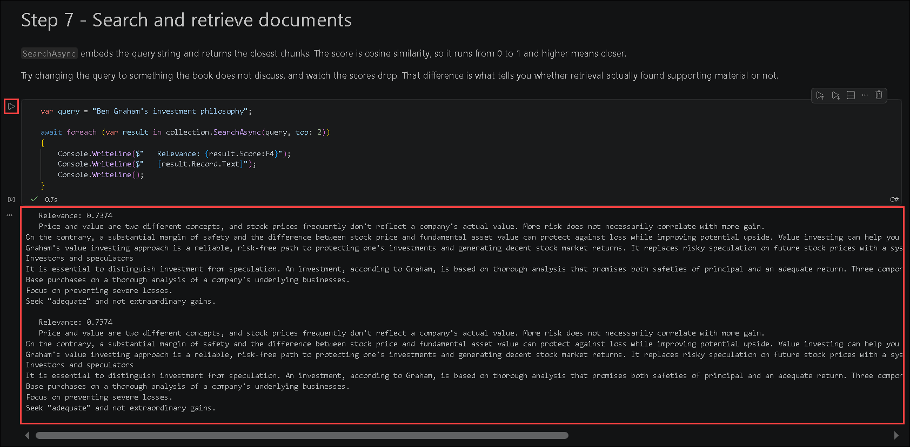

1. In the **Load the grounded prompt** code cell, click the **Run (▶)** button to execute the cell. Wait for the cell to complete successfully before proceeding to the next step

   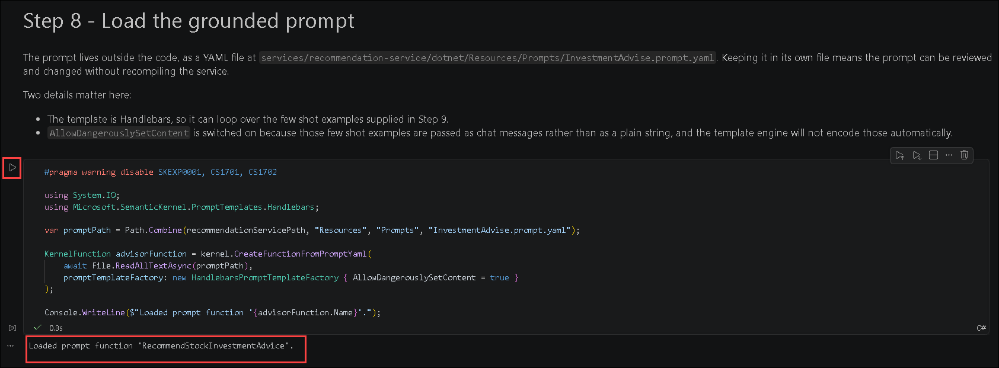

1. In the **Set the kernel arguments** code cell, click the **Run (▶)** button to execute the cell. 

   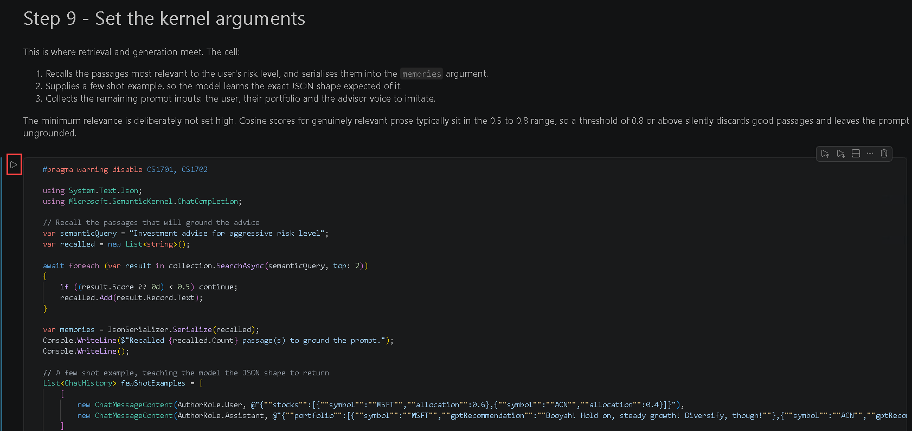

   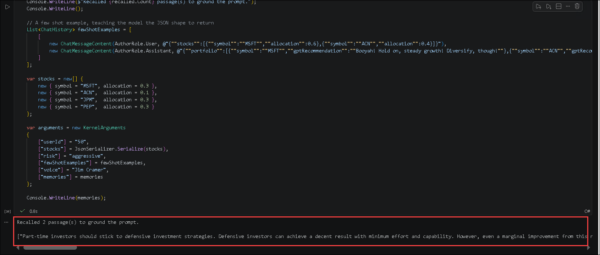

1. In the **Create a native function** code cell, click the **Run (▶)** button to execute the cell. 

   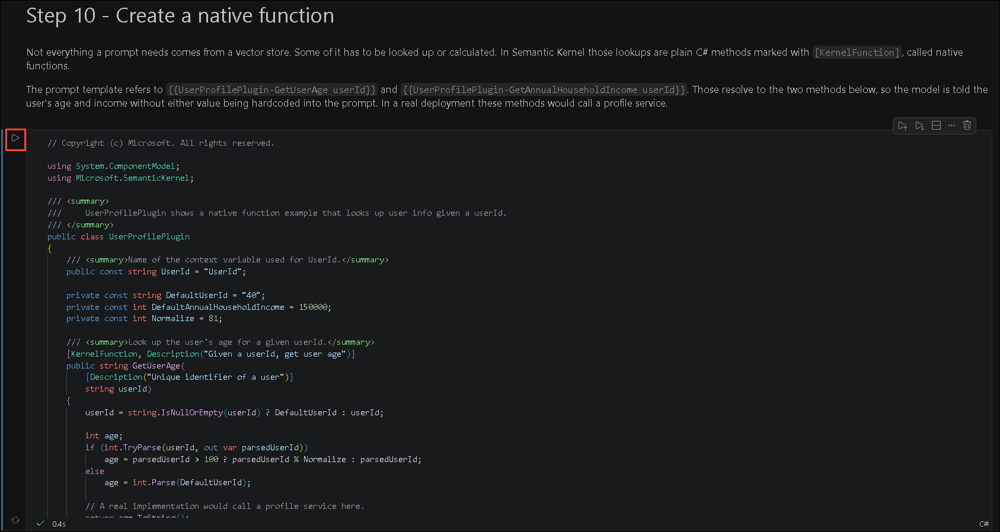

   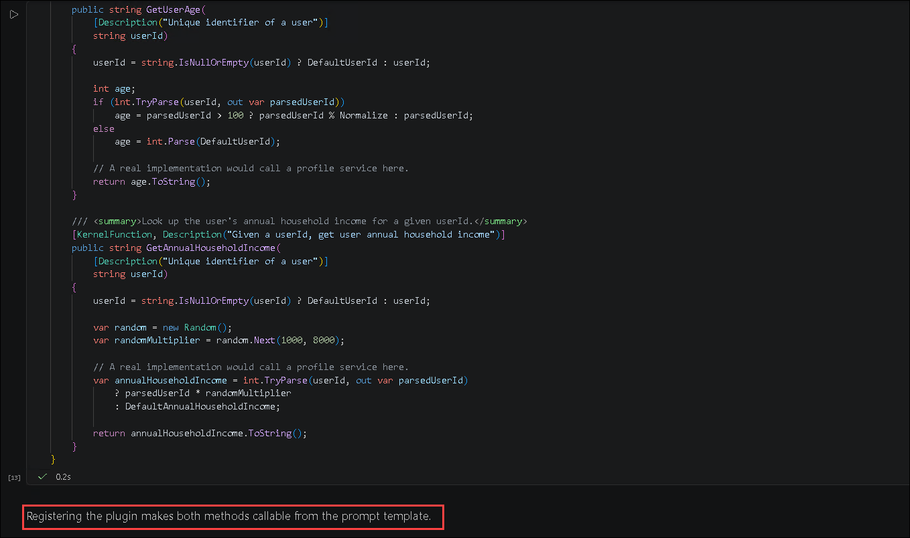

   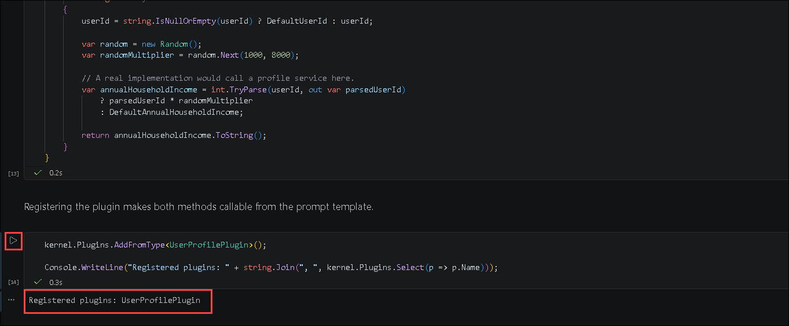

1. In the **Invoke the LLM** code cell, click the **Run (▶)** button to execute the cell. 

   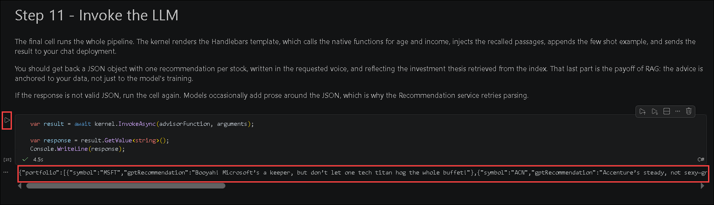

## Task 3: Run recommendation service locally

In this lab, you will set up the environment, install necessary dependencies, and run the Recommendation service locally to test and develop features effectively.

1. Open a new terminal by navigating to **miyagi/services/recommendation-service/dotnet** and right-clicking in the cascading menu to select **Open in Integrated Terminal**.

    

1. Run the following commands to start the recommendation service locally:

    ```
    dotnet build
    dotnet run
    ```

   >**Note:** If you encounter any failures while running this command, please verify the appsettings.json file. **[Expand miyagi/services/recommendation-service/dotnet directory and verify the appsettings.json]**, if the required values are missing or not configured correctly, navigate to Task 1, Step 7 and update the file with the appropriate values and try running above commands again.

   > **Note**: Let the command run; meanwhile, you can proceed with the next step.

1. Open another tab in Edge, in the browser window, paste the following link

   ```
   http://localhost:5224/swagger/index.html 
   ```

   > **Note**: Refresh the page continuously until you get the Swagger page for the recommendation service as depicted in the image below.

   


## Task 4: Run miyagi frontend locally

1. Navigate back to VS Code. Open a new terminal by navigating to **miyagi/ui** and right-clicking on **ui/typescript** in the cascading menu to select **Open in Integrated Terminal**.

   

   You must be in the `C:\LabFiles\miyagi\ui\typescript` directory.

1. Run the following command to install the dependencies
   
    ```
    npm install --global yarn
    yarn install
    yarn dev
    ```

   > **Note**: Let the command run; meanwhile, you can proceed with the next step.

1. Open another tab in Edge and browse to the following

   ```
   http://localhost:4001
   ```

   > **Note**: Refresh the page continuously until you get Miyagi app running locally as depicted in the image below.
                       
   

   > **Note**: If you encounter any pop-up error, close it and proceed to the next task.
   
## Task 5: Persist embeddings in Azure AI Search

1. Navigate back to the **swagger UI** page, scroll to **Memory** session, click on **POST /datasets** for expansion, and click on **Try it out**.

   

1. Replace the code with the below code, and click on **Execute**.

     ```
     {
        "metadata": {
              "userId": "50",
              "riskLevel": "aggressive",
              "favoriteSubReddit": "finance",
              "favoriteAdvisor": "Jim Cramer"
            },
          "dataSetName": "intelligent-investor"
      }
      ```

      
      
1. In the **swagger UI** page, scroll down to the **Responses** section, review that it has been executed successfully by verifying that the status code is **200**.

    

1. Navigate back to the **Azure portal** tab, search and select **AI Search**.

        

1. In **Microsoft Foundry | AI Search** tab, select **acs-<inject key="DeploymentID" enableCopy="false"/>**.

1. In **acs-<inject key="DeploymentID" enableCopy="false"/>**, from the left navigation menu click on **Indexes** **(1)** under **Search management**, and review the **miyagi-embeddings** **(2)** has been created.   

    

    > **Note**: Click the refresh button to view the **Document Count**.

>**Congratulations** on completing the Task! Now, it's time to validate it. Here are the steps:
  > - Hit the Validate button for the corresponding task. If you receive a success message, you have successfully validated the lab. 
  > - If not, carefully read the error message and retry the step, following the instructions in the lab guide.
  > - If you need any assistance, please contact us at cloudlabs-support@spektrasystems.com.

<validation step="07efcc74-3b48-4da3-8be6-00bf71986f9e" />

## Task 6: Explore the Miyagi App and Recommendation service  by Personalizing

1. Navigate back to the **recommendation service** UI page, and click on **Personalize** button.

    

1. In the **personalize** page, select your **financial advisor** from the drop-down, and click on **Personalize**.

     

1. You should see the recommendations from the recommendation service in the Top Stocks widget.

    

1. Navigate to the **Visual Studio Code**, and click on **dotnet** from the terminal, and you can go through the logs.

       

1. Once you view the logs, press **Ctrl + C** to stop the **swagger UI** page.

1. From the terminal, select the Node terminal and press **Ctrl + C** to stop the Recommendation service UI page.

## Summary

In this lab, you have accomplished the following:

- Installed dependencies and configured the database for the Miyagi app.
- Explored algorithms and methods used in the Recommendation service.
- Launched the Recommendation service locally and verified its functionality.
- Executed the Miyagi frontend locally to test user interactions.
- Configured and stored embeddings in Azure AI Search successfully.
- Personalized recommendations in the Miyagi app and tested user preference responses.

### You have successfully completed the lab
